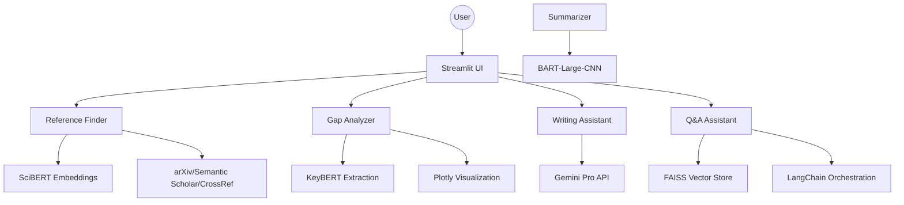

# 🎓 Academic Research Assistant

[](https://opensource.org/licenses/MIT)
[](https://www.python.org/downloads/)
[](https://streamlit.io/)
[](https://ai.google.dev/)

A comprehensive, AI-powered research ecosystem designed to empower academics and researchers. This tool streamlines the entire research lifecycle—from paper discovery and gap analysis to writing assistance and summarization.

## 🚀 Key Features

### 🔍 Smart Reference Finder
*   **Semantic Search**: Uses **SciBERT** embeddings to find papers based on conceptual meaning, not just keywords.
*   **Multi-Platform**: Aggregates results from **arXiv**, **Semantic Scholar**, and **CrossRef**.
*   **Impact Scoring**: Calculates a custom "Impact Score" based on citations, recency, and venue prestige.

### 🕳️ Research Gap Analyzer
*   **Landscape Visualization**: Generates a 2D map of the research field using PCA-reduced embeddings.
*   **Outlier Detection**: Identifies "research gaps" by finding papers that deviate from the field's center.
*   **Keyword Opportunities**: Uses **KeyBERT** to find emerging trends and untapped research directions.

### ✍️ AI Writing Assistant
*   **Section-Wise Guidance**: Powered by **Gemini Pro**, providing tailored advice for Abstract, Introduction, Methodology, etc.
*   **Real-time Feedback**: Analyzes your writing for academic tone, clarity, and structural integrity.
*   **Export Ready**: Download your structured paper content in JSON format.

### 📄 Paper Summarizer
*   **Sectional Breakdown**: Automatically extracts and summarizes individual sections of a paper.
*   **BART-Large-CNN**: Uses state-of-the-art transformer models for high-quality abstractive summarization.
*   **Quality Metrics**: Evaluates summaries using **ROUGE** scores.

### 💬 Q&A Assistant (RAG)
*   **Contextual Intelligence**: Upload any PDF and ask complex questions.
*   **RAG Architecture**: Uses **FAISS** vector storage and **LangChain** for precise information retrieval.
*   **OCR Support**: Integrated **Tesseract** support for scanned PDFs and images.

## 🛠️ Technical Architecture



## ⚙️ Installation & Setup

### Prerequisites
*   Python 3.9 or higher
*   Google Gemini API Key ([Get one here](https://aistudio.google.com/app/apikey))
*   (Optional) Tesseract OCR for image processing

### Quick Start
1.  **Clone the repository**:
    ```bash
    git clone https://github.com/SanjayBukka/AcademicResearchAssistant.git
    cd AcademicResearchAssistant
    ```

2.  **Install dependencies**:
    ```bash
    pip install -r requirements.txt
    ```

3.  **Set up environment**:
    ```bash
    cp .env.example .env
    # Add your GEMINI_API_KEY to the .env file
    ```

4.  **Run the app**:
    ```bash
    streamlit run main.py
    ```

## 🌐 Deployment

This project is optimized for **Streamlit Cloud**, **Docker**, and **Heroku**.

*   **Docker**: `docker-compose up --build`
*   **Streamlit Cloud**: Connect your GitHub repo and add `GEMINI_API_KEY` to secrets.

## 📄 License

This project is licensed under the MIT License - see the [LICENSE](LICENSE) file for details.

## 🤝 Contributing

Contributions are welcome! Please see [CONTRIBUTING.md](CONTRIBUTING.md) for guidelines.

---
*Developed as part of the Semester 6 Applicative Project | 2024-2025*
